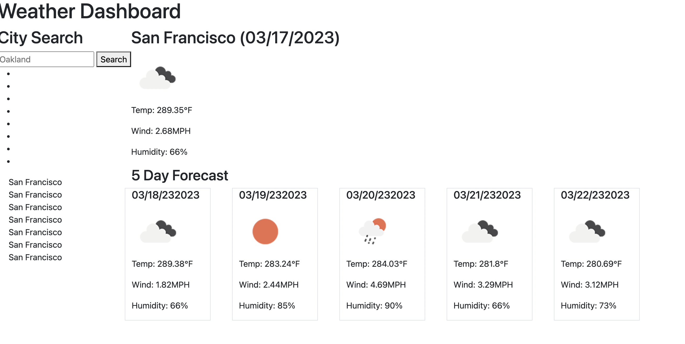

# HomeWork-6-Weather-Dashboard-Application# Note Taker Starter Code
# TITLE
Weather DashBoard
# DESCRPIPTION
 This app presents you with 5-Day forecast of any city that you search. It calls upon an api from Openweathermap.org.

 # TABLE OF CONTENTS

- [INSTALLATION](#installation)
- [LINK](#link)
- [SCREENSHOTS](#screenshots)
- [QUESTIONS](#questions)

# INSTALLATION
To properly run this application, clone a copy of the repository from GitHub. 
 # LINK

GitHub Repository: https://github.com/HawaFallay/HomeWork-6-Weather-Dashboard-Application

Deployed App: https://hawafallay.github.io/HomeWork-6-Weather-Dashboard-Application/
# SCREENSHOTS

# QUESTIONS
Link to my Github where contrubtions are welcome
https://github.com/HawaFallay

Contact:
HawaFallay@gmail.com
